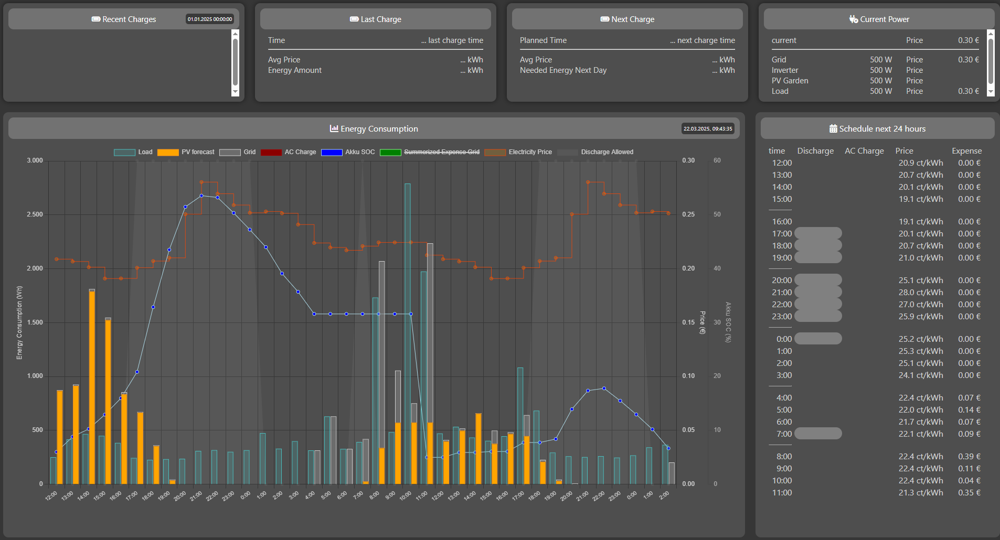

# EOS Connect

EOS Connect is a tool designed to optimize energy usage by interacting with the [EOS (Energy Optimization System)](https://github.com/Akkudoktor-EOS/EOS). It fetches energy data, processes it, controls a FRONIUS inverter and connected battery and displays the results dynamically on a webpage.

- [EOS Connect](#eos-connect)
  - [Features](#features)
  - [Current Status](#current-status)
  - [How it Works](#how-it-works)
    - [Base](#base)
    - [Collecting Data](#collecting-data)
      - [Home Assistant](#home-assistant)
      - [OpenHAB](#openhab)
      - [PV Forecast](#pv-forecast)
      - [Energy Price Forecast](#energy-price-forecast)
  - [Webpage Example](#webpage-example)
  - [Configuration](#configuration)
  - [Useful Information](#useful-information)
    - [Getting historical values](#getting-historical-values)
      - [Homeassistant](#homeassistant)
      - [Openhab](#openhab-1)
  - [Usage](#usage)
  - [Requirements](#requirements)
  - [Installation and Running](#installation-and-running)
  - [Running the Application](#running-the-application)
    - [Using Docker](#using-docker)
    - [Using in Home Assistant with an Add On](#using-in-home-assistant-with-an-add-on)
    - [Local](#local)
      - [Installation](#installation)
      - [Running Locally](#running-locally)
  - [Contributing](#contributing)
  - [License](#license)


## Features
* Fetches energy or battery data from OpenHAB or HomeAssistant.
* Processes data to create a load profile.
* Interacts with the Tibber API and PV forecast API.
* Manages configurations via a user-friendly config.yaml file.
* Displays results dynamically on a webpage.
* Controlling FRONIUS inverters and battery charging systems interactively.
* Battery charging is dynamicaly limited depending on the SOC (charging curve)

## Current Status

This project is in its early stages and is actively being developed and enhanced.

2025-04-10

- EOS made a breaking change - see here https://github.com/Akkudoktor-EOS/EOS/discussions/513
- there were also changes in the API at '<your_ip>:8503' - unfortunately the API is not versioned (*ping* ;-) )
- to fullfil both versions there is small hack to identify the connected EOS
- finally the current version can run with both EOS versions

---

## How it Works

### Base

**EOS Connect** is a self-running system that periodically collects:
- Local energy consumption data.
- PV solar forecasts for the next 48 hours.
- Upcoming energy prices.

Using this data, a request is sent to EOS, which creates a model predicting the energy needs based on different energy sources and loads (grid, battery, PV).

**EOS Connect** waits for the response from EOS (e.g., ~2 min 15 sec for a full 48-hour prediction on a Raspberry Pi 5). After receiving the response, it is analyzed to extract the necessary values.

Finally, the system sets up the inverter based on the following states:
- `MODE_CHARGE_FROM_GRID` with a specific target charging power (based on your configuration).
- `MODE_AVOID_DISCHARGE`.
- `MODE_DISCHARGE_ALLOWED` with a specific target maximum discharging power (based on your configuration).

The system repeats this process periodically, e.g., every 3 minutes, as defined in the configuration.

---

### Collecting Data

Data collection for load forecasting is based on your existing load data provided by an OpenHAB or Home Assistant instance (using the persistence of each system). EOS requires a load forecast for today and tomorrow.

#### Home Assistant
Load data is retrieved from:
- Today one week ago, averaged with today two weeks ago.
- Tomorrow one week ago, averaged with tomorrow two weeks ago.

(See [Home Assistant](#home-assistant) for more details.)

#### OpenHAB
Load data is retrieved from the last two days:
- From two days ago (00:00) to yesterday midnight.
(hint: )

#### PV Forecast
PV forecasts are retrieved directly from the [AKKUDOKTOR API](https://api.akkudoktor.net/forecast).

#### Energy Price Forecast
Energy price forecasts are retrieved from the chosen source (TIBBER or AKKUDOKTOR API). **Note**: Prices for tomorrow are available earliest at 1 PM. Until then, today's prices are used to feed the model.

---

## Webpage Example

The dashbaord of **EOS connect** is available at `http://localhost:8081`.



## Configuration

With the first start of **EOS connect** a default `config.yaml` will be generated in the `\src` folder. For full documentation for the different entries go to [CONFIG_README](src/CONFIG_README.md)

With the default config and a valid EOS server IP/DNS name **EOS connect** should be running out of the box.

## Useful Information

### Getting historical values

#### Homeassistant

The tool will use historical data from Home Assistant's local database. By default, this database is configured with a retention period of **10 days**.

To improve the accuracy of load forecasts, it is recommended to use data from the last **2 weeks**. 

You can extend the retention period by modifying the `recorder` configuration in Home Assistant's `configuration.yaml` file. If the `recorder` section is not already present, you can add it as shown below:

```yaml
recorder:
  purge_keep_days: 15  # Keep data for 15 days
```

After making this change, restart Home Assistant for the new retention period to take effect.

**Note**: Increasing the retention period will require more storage space, depending on the number of entities being recorded.

If you do not change the retention period, the tool will still work, but it will use the available 10 days of data, which may result in less accurate load forecasts.

#### Openhab

No specific info yet.

## Usage

The application will start fetching energy data from OpenHAB or HomeAssistant and processing it. You can access the web interface at `http://localhost:8081`. For local usage the port is configurable see [CONFIG_README](src/CONFIG_README.md). For docker usage change the mapped port in docker-compose.yml.

## Requirements

To run this project, you need to have the following installed:

- Python 3.x


## Installation and Running

## Running the Application

### Using Docker

You need to have the following additionally installed:

- Docker
- Docker Compose

Pull existing latest snapshot and run the application in the background using Docker Compose (`--pull always` ensures the latest image is pulled):
   ```
   docker-compose up --pull always -d
   ```
[](https://github.com/ohAnd/EOS_connect/pkgs/container/eos_connect)

[](https://github.com/ohAnd/EOS_connect/pkgs/container/eos_connect)


### Using in Home Assistant with an Add On

see https://github.com/ohAnd/ha_addons

or directly

[](https://my.home-assistant.io/redirect/supervisor_add_addon_repository/?repository_url=https%3A%2F%2Fgithub.com%2Fohand%2Fha_addons)

### Local

#### Installation
1. Clone the repository:
   ```
   git clone <repository-url>
   cd EOS_connect
   ```

2. Install the required Python packages (for local usage):
   ```
   pip install -r requirements.txt
   ```
#### Running Locally

Run the application locally without Docker, you can execute the following command:
```
python src/eos_connect.py
```

## Contributing

Contributions are welcome! Please submit a pull request or open an issue for any suggestions or improvements.

## License

This project is licensed under the MIT License. See the LICENSE file for more details.